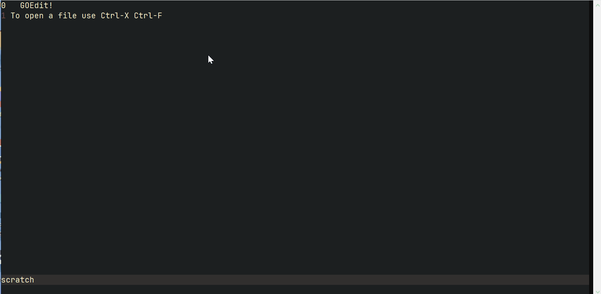

# GoEdit

Linux TUI text editor written in Golang and using goncurses package for UI.

Features:

- emacs keybindings
- command minibuffer
- editing is done using a gap buffer

Currently implemented:
- movement (up/down, fw/bw, word fw/bw, line start/end, file start/end)
- select (using alt+space because ctrl+space has a weird mapping in terminal)
- cut selection, cut line, copy selection, yank
- undo

